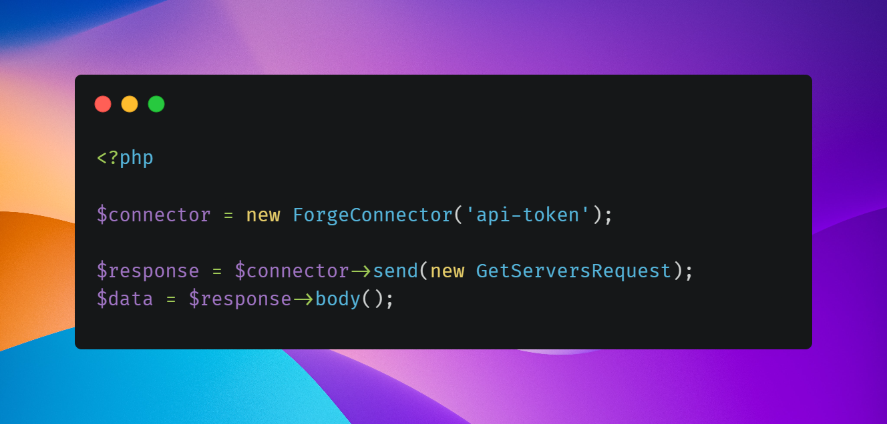

# 🤠 Saloon

<figure><figcaption></figcaption></figure>


You are viewing the documentation for Saloon v2. If you are using version one, [click here](http://127.0.0.1:5000/s/WZee3WHlwQmemMUmidXH/).


### Introduction

Saloon is a PHP library that provides you with a beautiful API integration framework. It gives you all the tools you need to build and test API integrations for your application or SDKs. It can be easily customised with plugins, but It comes pre-configured for you so you can get to sending API requests right away. Saloon comes with many exciting features out of the box like recording requests in your tests, caching, OAuth2 and pagination.

<figure><figcaption></figcaption></figure>

### Key Features

* Provides a simple, easy-to-learn, object-oriented syntax that standardises the way you interact with APIs
* No HTTP client configuration is required but can be completely customised if you need
* Abstract API integrations into classes to keep your code tidy and centralised
* Great for building your next PHP SDKs or package/library
* Works great within a team as it provides a standard everyone can follow
* Application/framework agnostic
* Packed full of features like request recording, request concurrency, caching, data-transfer-object support, and full Laravel support.
* Fully extendable and welcomes your own implementations
* Uses Guzzle, the most popular PHP HTTP client


[Please consider giving Saloon a star on GitHub!](https://github.com/sammyjo20/saloon) (Over 1,000 stars already!)



[installation.md](getting-started/installation.md)

