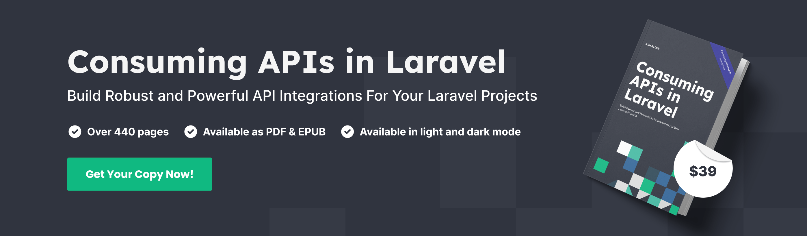

# 📘 Official Book!

<figure><figcaption></figcaption></figure>

We're super excited to partner with [Ash Allen](https://twitter.com/AshAllenDesign) with his latest book - _Consuming APIs in Laravel**.**_ This book with over 440 pages contains everything you need to build awesome API integrations in Laravel. The book uses Saloon as the tool to build the integrations, so it's a great way to learn Saloon inside out too!

You'll also learn about the most common types of APIs, How OAuth2 works and how to handle webhooks securely.


Use code **SALOON** at checkout to get **20% off** the "Consuming APIs in Laravel" book or the book bundle with "Battle Ready Laravel"!


[Pick up your copy today at consuming-apis-in-laravel.com!](https://consuming-apis-in-laravel.com/?aff=DGMrX)
