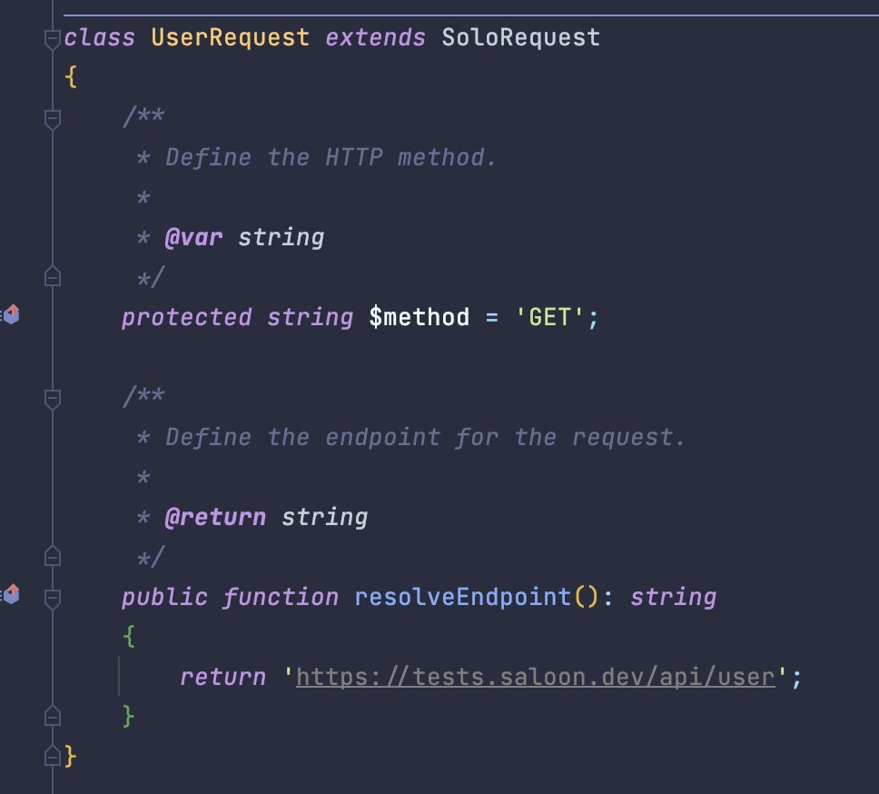

# 🔑 OAuth2 Authentication

Saloon supports some OAuth2 authentication grants out of the box which you can use in your application. They come in the form of traits that can be easily added to your connector and then configured to your needs. Read more below by finding the grant type you would like to use

### Authorization Code Grant

This flow is the typical process where your application redirects your users to a third party to approve your authentication request. After they have approved the authentication request, they will be redirected back to your application where you can generate access tokens.


[oauth2-authentication.md](oauth2-authentication.md)


<figure><figcaption>
Source: Auth0 <a href="https://auth0.com/docs/get-started/authentication-and-authorization-flow/authorization-code-flow">https://auth0.com/docs/get-started/authentication-and-authorization-flow/authorization-code-flow</a>
</figcaption></figure>

### Client Credentials Grant

This flow is often used for internal server-to-server authentication. Like a shopping website communicating with an internal warehouse API. You are often given a single access token which can be used to generate access tokens.


[client-credentials-grant.md](client-credentials-grant.md)


<figure><figcaption>
Source: Auth0 <a href="https://auth0.com/docs/get-started/authentication-and-authorization-flow/client-credentials-flow">https://auth0.com/docs/get-started/authentication-and-authorization-flow/client-credentials-flow</a>
</figcaption></figure>
